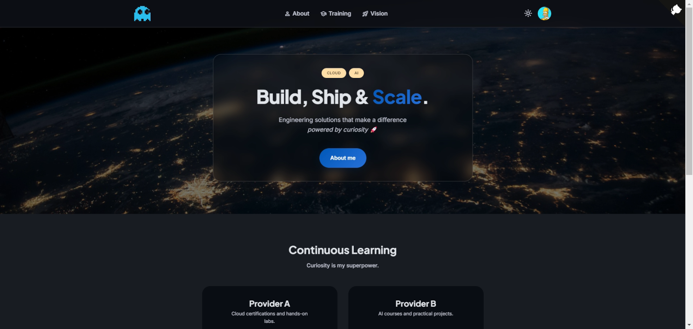

# colomr-v1

A personal portfolio theme for [Hugo](https://gohugo.io/) built with **Material Design 3**. Designed with [Google Stitch 2](https://stitch.withgoogle.com) and implemented with [Claude](https://claude.ai).

Dark mode by default, responsive, lightweight, and fully configurable from front matter — no HTML editing needed.



## Features

- Dark / Light mode toggle (dark by default)
- Cover images with configurable overlay effects (glass, vignette, shadow, highlight)
- Notion-style block system for interior pages (text, cards, timeline, contact)
- Provider tabs with badge grid (for certifications/courses)
- Material Symbols + Font Awesome icons
- Responsive: desktop nav + mobile bottom nav
- SCSS with MD3 design tokens (easy color/font customization)
- Google Analytics support

## Requirements

- Hugo Extended >= 0.120.0
- Google Fonts loaded via CDN (Plus Jakarta Sans, Inter, Material Symbols)

## Installation

```bash
cd your-hugo-site
git submodule add https://github.com/colomr-dev/colomr-v1-theme.git themes/colomr-v1
```

Set the theme in `hugo.toml`:

```toml
theme = "colomr-v1"
```

## Quick start

Copy the `exampleSite/` contents to your project root and run:

```bash
hugo server
```

## Configuration

### hugo.toml

```toml
baseurl = "https://example.com/"
title = "My Personal Site"
theme = "colomr-v1"
languagecode = "en"

# Disable taxonomies (not used)
[taxonomies]

[params]
  author = "Jane Doe"
  description = "Software Engineer"
  keywords = "portfolio, cloud, engineering"
  avatarurl = "/images/avatar.png"
  favicon_32 = "/images/favicon-32x32.png"
  favicon_16 = "/images/favicon-16x16.png"
  since = 2024

# Social links (displayed in footer)
[[params.social]]
  name = "Github"
  icon = "fa fa-github fa-2x"
  weight = 1
  url = "https://github.com/"

# Navigation links (icon = Material Symbols name)
[[params.nav_links]]
  label = "About"
  url = "/about/"
  nav_icon = "person"
```

### Static assets

Place these files in `static/images/`:

| File | Purpose | Recommended size |
|------|---------|-----------------|
| `logo.png` | Site logo (header) | 120x120 px |
| `avatar.png` | Author avatar (header) | 200x200 px |
| `favicon-32x32.png` | Browser favicon | 32x32 px |
| `favicon-16x16.png` | Browser favicon | 16x16 px |

## Layouts

### Home page (`index.html`)

The home page reads from `content/_index.md` front matter. Three sections:

```yaml
hero:
  cover: "/images/covers/hero.webp"          # background image (optional)
  cover_opacity: "0.55"                       # overlay opacity 0-1 (default 0.65)
  cover_effect: "glass"                       # glass | vignette | shadow | highlight
  cover_position: "center center"             # CSS background-position
  chips: ["CLOUD", "AI"]
  title: "Build, Ship &"
  titleHighlight: "Scale"                     # gradient text
  subtitle: "Your tagline here"
  subtitleEmphasis: "in italics"
  subtitleEmoji: "🚀"
  ctas:
    - label: "About me"
      url: "/about/"
      style: "primary"                        # primary | ghost

learning:
  title: "Section Title"
  subtitle: "Section subtitle"
  cards:
    - name: "Card Name"
      desc: "Description"
      url: "/link/"
      icon: "my-icon"                         # loads partials/icons/my-icon.html (optional)
      cssModifier: ""                         # extra CSS class (optional)

context:
  heading: "A bold statement"
  body: "Supporting text. Use <span class=\"context__emphasis\">emphasis</span> for highlights."
  icon: "architecture"                        # Material Symbol name
  stat: "10+"
  statLabel: "YEARS OF EXPERIENCE"
```

### Blocks page (`blocks.html`)

For interior pages with a Notion-style block system. Set `layout: "blocks"` in front matter.

```yaml
layout: "blocks"
cover: "/images/covers/about.webp"
cover_ratio: "3 / 1"                          # 3/1 (default) | 16/9 | 4/1
cover_position: "center center"
cover_opacity: "0.5"
icon: "👩‍💻"
pageTitle: "Page Title"
subtitle: "Subtitle"
tags_list:
  - label: "Tag"

blocks:
  - type: "text"
    heading: "Heading"
    body: "Paragraph text."

  - type: "cards"
    heading: "Heading"
    items:
      - icon: "cloud"                         # Material Symbol name
        title: "Card Title"
        body: "Card description"

  - type: "timeline"
    heading: "Experience"
    items:
      - role: "Job Title"
        company: "Company"
        period: "2022 – present"

  - type: "contact"
    heading: "Get in touch"
    body: "Optional intro text."              # displayed above links
    items:
      - label: "LinkedIn"
        url: "https://linkedin.com/"
        icon: "fa fa-linkedin"                # Font Awesome 4 class
```

### Providers page (`providers.html`)

For displaying badges/certifications organized by provider tabs. Set `layout: "providers"` in front matter.

```yaml
layout: "providers"

intro:
  heading: "Intro Title"
  body: "Intro paragraph."

providers:
  - id: "provider-a"                          # used for tab switching
    name: "Provider A"                        # tab label
    profile_url: "https://..."                # link button (omit to hide)
    profile_label: "View my profile"
    data: "badges_a"                          # loads data/badges_a.json
```

#### Badge data format

Create a JSON file in `data/` for each provider:

```json
[
  {
    "titulo": "Badge Name",
    "url": "https://link-to-badge",
    "img": "https://badge-image-url.png",
    "fecha": "2025-03-01"
  }
]
```

The theme displays the **6 most recent** badges per provider, sorted by `fecha`.

## Customization

### Colors and fonts

Edit `assets/scss/_tokens.scss`. All colors follow the MD3 color system. Use [Material Theme Builder](https://material-foundation.github.io/material-theme-builder/) to generate a palette and replace the CSS custom properties.

Key variables:

| Variable | Purpose |
|----------|---------|
| `--color-primary` | Brand color, CTAs, active states |
| `--color-background` | Page background |
| `--color-on-surface` | Main text color |
| `--font-display` | Headings font |
| `--font-body` | Body text font |
| `--gradient-primary` | Title highlight gradient |

### Icons

| System | Usage | Browse |
|--------|-------|--------|
| Material Symbols Outlined | UI, nav, block cards | [fonts.google.com/icons](https://fonts.google.com/icons) |
| Font Awesome 4.7 | Social links, contact | [fontawesome.com/v4/icons](https://fontawesome.com/v4/icons/) |

### Adding a new block type

1. Add `{{ else if eq .type "myblock" }}` in `layouts/_default/blocks.html`
2. Add styles in `assets/scss/_page.scss`
3. Use it in front matter: `- type: "myblock"`

### Learning card icons

The home page learning cards can optionally display custom icons via Hugo partials. Create `layouts/partials/icons/my-icon.html` with your SVG or `` and reference it with `icon: "my-icon"` in the front matter.

## Commands

```bash
hugo server                          # local dev with live reload
hugo --cleanDestinationDir           # production build

# Run exampleSite
hugo server --source themes/colomr-v1/exampleSite --themesDir ../..
```

## License

GPL-3.0 — See [LICENSE](LICENSE) for details.

## Author

**Francisco Colomer** — [colomr.pm](https://colomr.pm)

Designed with [Google Stitch 2](https://stitch.withgoogle.com) and built with [Claude](https://claude.ai).
